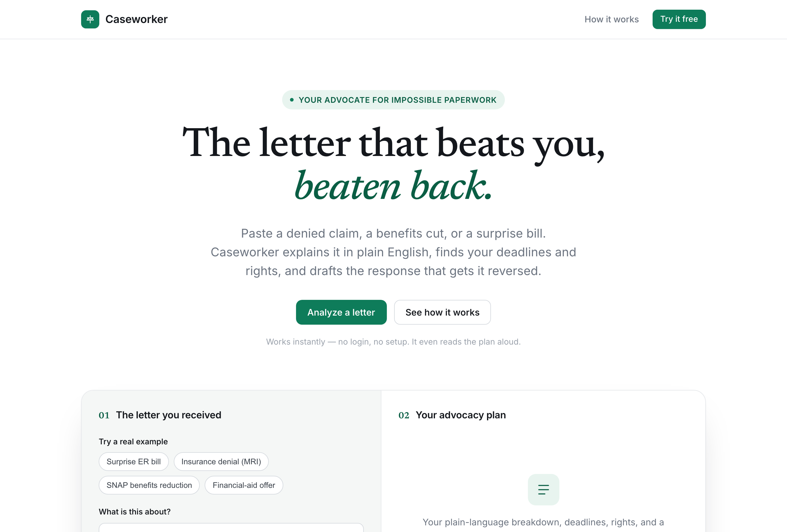
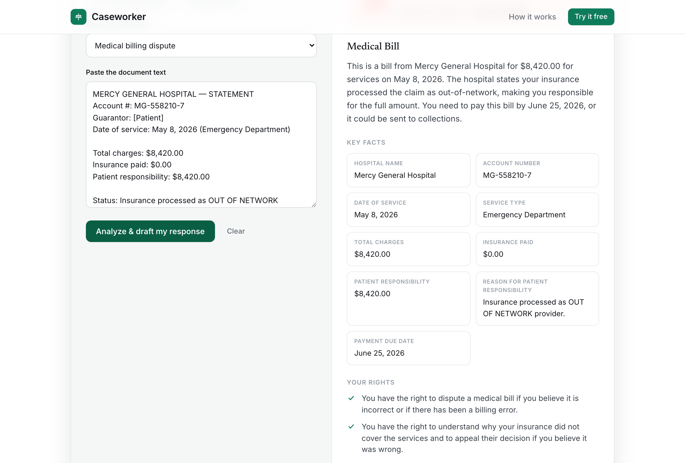

<div align="center">

# ⚖️ Caseworker

### Your AI advocate for impossible paperwork

[](https://caseworker-eta.vercel.app)
&nbsp;
[](https://caseworker-eta.vercel.app)


<br />



</div>

---

Snap a photo of the letter that's ruining your week — a denied insurance claim,
a SNAP benefits cut, a surprise ER bill, a thin financial-aid offer — or paste
the text, and Caseworker:

1. **Explains it in plain English** (8th-grade reading level, no jargon).
2. **Surfaces your rights** in that specific situation.
3. **Extracts every deadline** so you don't miss the appeal window.
4. **Gives ordered next steps.**
5. **Drafts the response that gets it reversed** — ready to copy, sign, and send.
6. **Reads it back to you** in a calm human voice (accessibility-first).

> 70M+ people in the US rely on benefits programs, ~1 in 7 insurance claims is
> denied, and the majority of denied claims are *never appealed* — even though a
> large share of appeals succeed. The barrier isn't eligibility, it's the
> paperwork. Caseworker removes the paperwork.

---

## 🎬 30-second demo

```bash
npm install
cp .env.example .env.local   # optional — works with NO keys in demo mode
npm run dev                  # http://localhost:3000
```

Open the app → **drop in a photo or PDF of a real letter** (or click a sample:
**Insurance denial**, **SNAP reduction**, **Surprise ER bill**) → hit
**Analyze**. You'll get the full advocacy plan and a drafted appeal in seconds.



**No API keys?** It still works, fully. Caseworker ships a deterministic *demo
mode* that does real extraction — it computes a **live deadline countdown**,
pulls amounts and case numbers, drafts the response, and reads it aloud via the
browser's speech engine. Samples are dated **relative to today**, so the
countdown is always realistic.

**Want live AI?** Set **either** key — the reasoning core picks the best
available (Claude → Gemini → demo):

- `GEMINI_API_KEY` — Google's **free tier**, uses `gemini-2.5-flash-lite`. The
  live demo runs on this. Get one at <https://aistudio.google.com/apikey>.
- `ANTHROPIC_API_KEY` — Claude, for top-tier quality (pay-as-you-go).

**Live:** https://caseworker-eta.vercel.app (currently powered by Gemini)

---

## 🏗️ Architecture

```
┌──────────────┐   POST /api/analyze   ┌─────────────────────┐
│  Next.js UI  │ ────────────────────▶ │  runCaseworker()    │
│ (App Router) │                       │  lib/caseworker.ts  │
│  voice btn ──┼── POST /api/speak ─┐  │                     │
└──────────────┘                    │  │  ├─ Claude (tools)  │  live reasoning
                                    │  │  └─ demo fallback   │  always works
        ┌───────────────┐          │  └─────────┬───────────┘
        │ ElevenLabs TTS│ ◀────────┘            │ same core
        └───────────────┘                       ▼
                                    ┌─────────────────────────┐
   ANY MCP client (Claude Desktop, │  Caseworker MCP server   │
   Cursor, agent harness) ────────▶│  mcp/server.ts (stdio)   │
                                    │  tools: analyze_document │
                                    │         draft_appeal     │
                                    │         list_domains     │
                                    └──────────────────────────┘
```

One reasoning core, three surfaces: a **web app**, an **HTTP API**, and an
**MCP server**. That's deliberate — see "Why this stacks tracks" below.

---

## 🔌 Sponsor integrations

Each integration is **essential and swappable**, with its own README section so
sponsor judges can see exactly what you used and why.

### Anthropic — Claude (reasoning core)
`lib/caseworker.ts` calls Claude via the Messages API with a **forced tool call**
(`return_analysis`) to guarantee clean structured output — summary, rights,
deadlines, actions, and the drafted letter. Claude is the brain: it reads
adversarial bureaucratic language and produces an accurate, non-hallucinated
advocacy plan. Upload a **photo or PDF** of the letter and Claude reads it
directly via vision / `document` blocks — no separate OCR step. Model is
configurable via `CASEWORKER_MODEL`.
→ Set `ANTHROPIC_API_KEY`.

### ElevenLabs — voice (accessibility)
`/api/speak` streams a calm spoken summary via ElevenLabs TTS. This isn't a
gimmick: the target users include the elderly, the visually impaired, and
people in crisis who can't face another wall of text. Voice *is* the
accessibility story. If no key is set, the **"Listen" button still works** by
falling back to the browser's built-in speech synthesis — so the demo is never
silent.
→ Set `ELEVENLABS_API_KEY` (and optionally `ELEVENLABS_VOICE_ID`) for the
premium voice.

### Model Context Protocol — MCP server
`mcp/server.ts` exposes Caseworker as MCP tools (`analyze_document`,
`draft_appeal`, `list_domains`) over stdio. Any agent or MCP client can now use
Caseworker as a capability. This makes Caseworker a reusable *agent tool*, not
just an app — the requirement for MCP / agent-platform tracks.

### Vercel — deploy
Zero-config Next.js deploy. `app/api/*` run as Vercel Functions (Fluid Compute,
Node.js runtime). `npx vercel` → live URL for your submission.

> Swap-in candidates for other events: **Vapi** (drop-in for the voice layer for
> a phone-call interface), **Tavus** (a video avatar that explains your denial
> letter), **Descope** (auth for saved cases), **Stripe** ("file on my behalf"
> premium tier). Each is an additive bounty with no core rewrite.

---

## 🧠 Use the MCP server from Claude Desktop / Cursor

Add to your MCP client config (e.g. `claude_desktop_config.json`):

```json
{
  "mcpServers": {
    "caseworker": {
      "command": "node",
      "args": ["--experimental-strip-types", "/ABSOLUTE/PATH/caseworker/mcp/server.ts"],
      "env": { "ANTHROPIC_API_KEY": "sk-ant-..." }
    }
  }
}
```

Then ask your agent: *"Use caseworker to analyze this denial letter and draft my
appeal."*

---

## 🏆 Why this stacks tracks (the submission strategy)

Caseworker is engineered to map onto multiple prize categories at once:

| Track / theme | How Caseworker fits |
|---|---|
| Education & Human Potential | financial-aid / FAFSA skin |
| Money & Financial Access | benefits enrollment, medical-bill disputes |
| Small Business Services | licensing, permits, grant applications |
| Professional Services | insurance appeals, dispute drafting |
| Social good | helps low-income / disabled / elderly navigate hostile systems |
| MCP / agents | ships a real MCP server with reusable tools |
| Voice | the whole UX is conversational + spoken |

**Re-skin, don't rebuild.** The domain selector (`lib/caseworker.ts` → `DOMAINS`)
re-themes the same engine per hackathon: lead with the financial-aid sample at an
edu event, the SNAP sample at a social-good event, the insurance sample at a
fintech event.

> ⚠️ Some hackathons forbid submitting a project entered elsewhere. Always check
> each event's reuse rules before re-submitting.

---

## 📁 Project layout

```
app/
  page.tsx              demo UI (before/after in one screen)
  api/analyze/route.ts  Claude reasoning endpoint
  api/speak/route.ts    ElevenLabs TTS endpoint
lib/
  caseworker.ts         the agent: prompt, schema, vision/PDF, demo fallback
  samples.ts            real-feeling sample documents
mcp/
  server.ts             Model Context Protocol server (stdio)
test/
  caseworker.test.ts    unit tests for the deterministic core
```

Run the tests with `npm test` — Node's built-in runner (`node --test`), no extra
dependencies. They cover date parsing, deadline extraction, the demo analyzer,
and the no-model-for-file guard.

## ⚖️ Disclaimer

Caseworker provides information and drafting help, **not legal advice**. It never
invents facts and flags what to verify. Always confirm deadlines against your own
documents.
